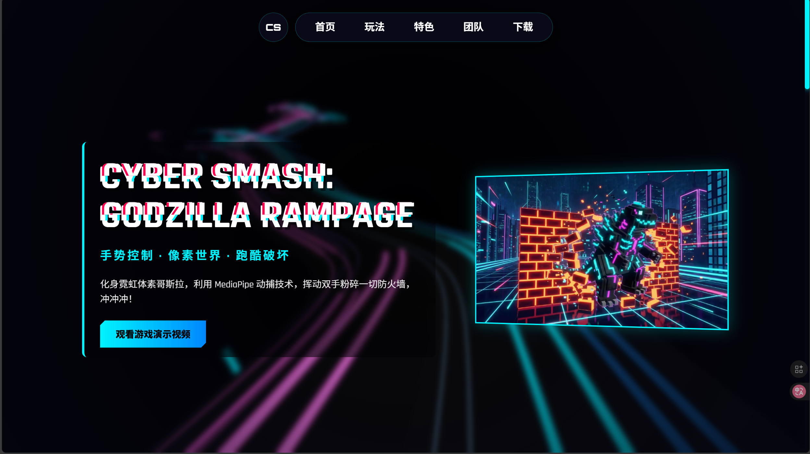
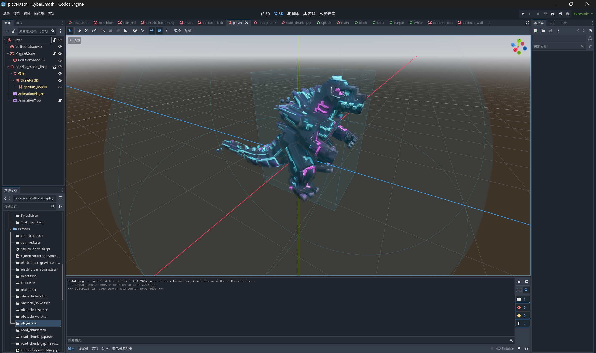
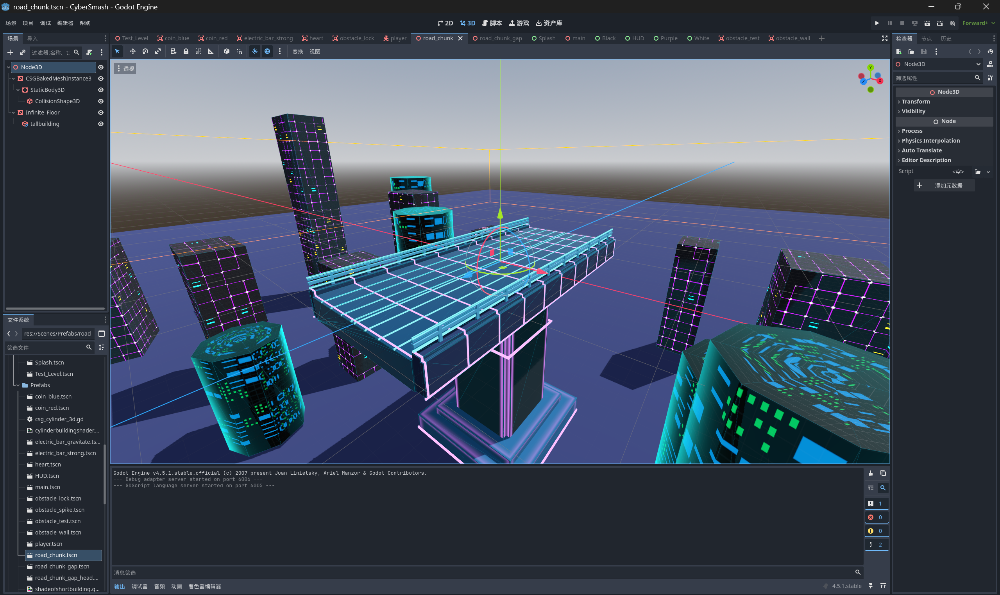
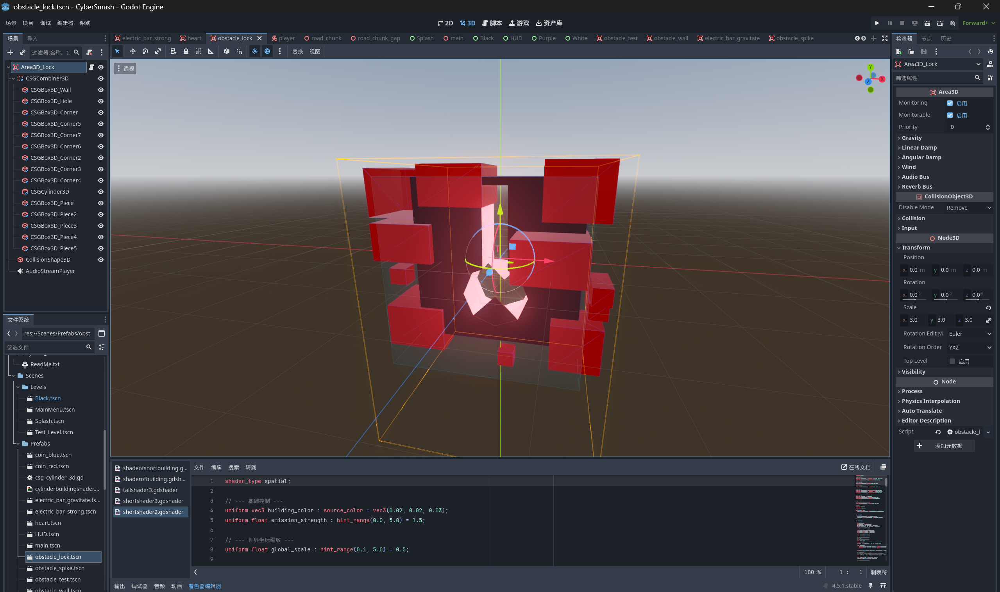
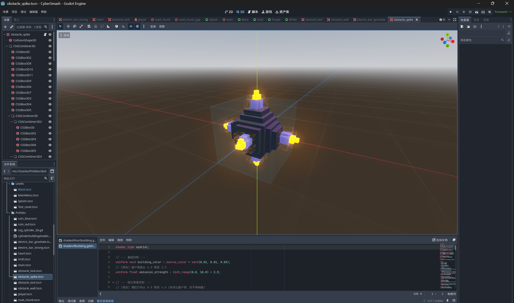
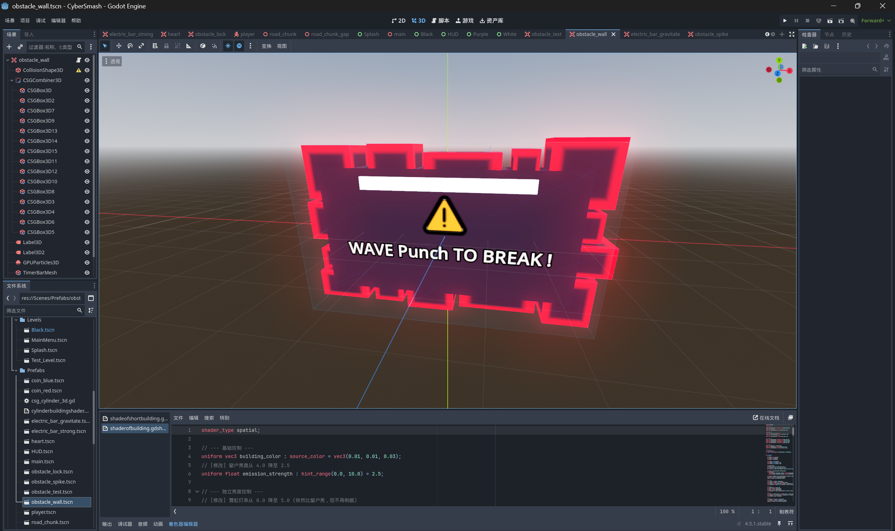
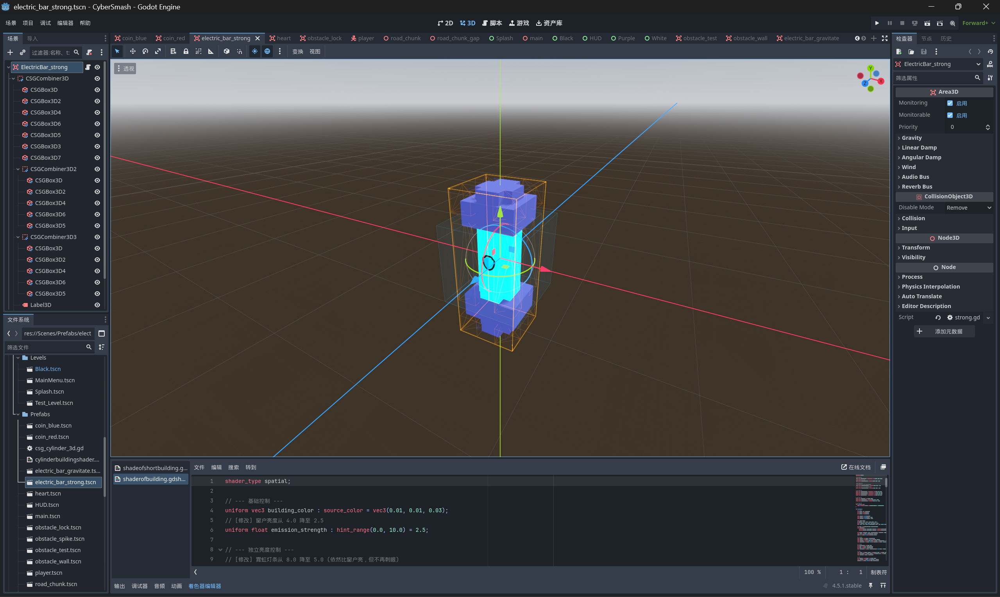
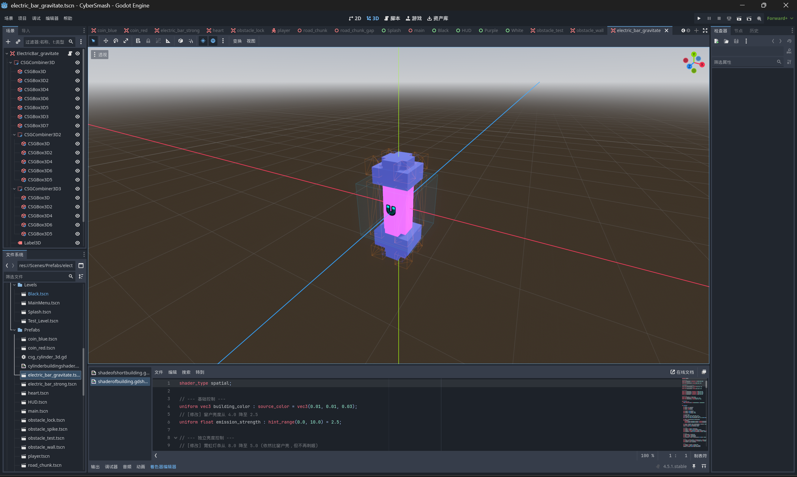
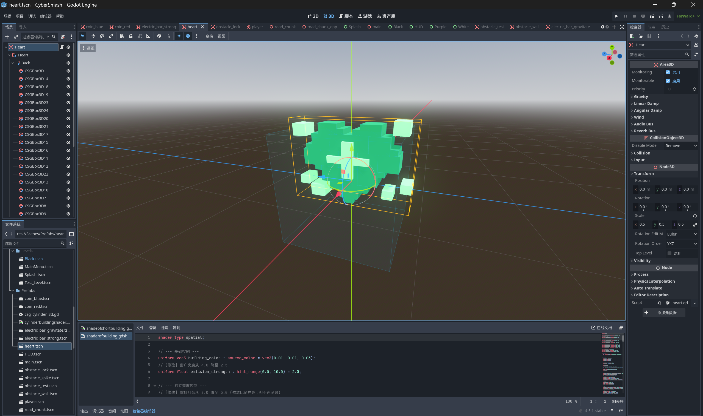

<div align="center">

# 🦖 Cyber Smash: Data Destruction

### (赛博黑客：数据大破坏)

*基于 Godot 4 引擎与 MediaPipe 视觉算法的 3D 体感跑酷游戏*




</div>

## 📖 项目简介

**Cyber Smash** 是一款融合了 **赛博朋克风格** 与 **体感交互技术** 的 3D 无尽跑酷游戏。

不同于传统游戏，本项目摒弃了键盘鼠标，创新性地使用 **Python MediaPipe** 捕捉玩家的手势动作，通过 **UDP 协议** 实时驱动 **Godot 引擎** 中的体素怪兽（Godzilla）。玩家需要在霓虹闪烁的数据世界中穿行，挥动双拳粉碎防火墙，跳跃躲避杀毒程序的追踪。

本项目是南开大学 Python 程序设计课程的综合实验作品。

## ✨ 核心亮点

* **👋 AI 视觉体感控制**：利用 OpenCV + MediaPipe 实现低延迟手势识别，支持移动、跳跃、攻击等动作。
* **🔌 跨进程通信架构**：Python（视觉端）与 Godot（游戏端）通过 UDP Socket (Port 4242) 进行解耦通信。
* **♾️ 程序化地图生成**：基于 Chunk 的无限地图生成算法，配合对象池技术优化性能。
* **🎨 独家体素美术**：原创的哥斯拉主角模型与赛博城市场景，包含完整的骨骼动画绑定。
* **🚀 一键部署体验**：提供 `Launcher.bat` 脚本，自动编排 AI 进程与游戏进程，即开即玩。

## 📸 游戏资产与截图

### 核心角色与场景
| **体素哥斯拉 (Player)** | **无限赛博赛道 (World)** |
| :---: | :---: |
|  |  |

### 障碍物系统
| **红锁力场** (不可跳跃) | **尖刺炸弹** (需跳跃) | **阻挡墙** (需握拳击破) |
| :---: | :---: | :---: |
|  |  |  |

### 道具与增益
| **无敌护盾** | **金币磁铁** | **医疗包** |
| :---: | :---: | :---: |
|  |  |  |

## 🎮 游戏操作指南

无需任何外设，只需要一个 **摄像头**！启动后请确保手部位于预览框内。

| 动作 | 手势操作 | 游戏反馈 |
| :--- | :--- | :--- |
| **左右移动** | 手掌在画面 **左 / 右** 区域平移 | 角色向左/右变道 |
| **跳跃** 🚀 | 手掌张开状态下 **快速上抬** | 角色跳跃，跨越断桥/炸弹 |
| **攻击** 👊 | 五指快速 **握拳** | 击碎前方的阻挡墙 (QTE) |
| **暂停** | 键盘 `Esc` | 暂停游戏 |

## 🛠️ 安装与运行

本项目已打包为 Windows 独立可执行文件，无需配置复杂的 Python 环境。

### 快速启动 (推荐)
1. 下载并解压 Release 包 `CyberSmash_V1.0.zip`。
2. 确保电脑连接有可用摄像头。
3. 双击根目录下的 **`Launcher.bat`**。
   * 脚本将自动启动 AI 视觉引擎（后台）和游戏客户端。
   * 退出游戏时，脚本会自动清理后台进程。

### 源码运行 (开发模式)
如果你想修改代码，请按以下步骤操作：


1. **Python 环境**:
   ```bash
   pip install opencv-python mediapipe
   python hand_controller/hand_controller.py


2.**Godot 环境:**

使用 Godot 4.5+ 打开 project.godot。

运行主场景 res://Scenes/Levels/Splash.tscn。

## 📂 项目结构
```
Plaintext
CyberSmash_Project/
├── Launcher.bat                # 一键启动脚本
├── CyberSmash_V1.0/            #  编译好的游戏包
│   ├── CyberSmash.exe          # Godot 游戏主程序
│   └── hand_controller/        # Python 视觉控制器
├── 项目源代码/
│   ├── Python_Controller/      # Python 源码 (hand_controller.py)
│   ├── Assets/                 # 美术资源 (模型, 贴图, 音效)
│   ├── Scenes/                 # Godot 场景文件 (.tscn)
│   └── Scripts/                # GDScript 逻辑脚本
└── 前端/                       # 配套宣传网站源码
    ├── index.html
    ├── style.css               # 包含 Glitch 特效与响应式布局
    └── hyperspeed.js           # Three.js 3D 背景特效
```
## 🏗️ 技术架构
系统采用 “生产者-消费者” 模型：
```
代码段
graph LR
    A[摄像头 Input] -->|OpenCV| B(Python 视觉端)
    B -->|MediaPipe| C{手势分析}
    C -->|Move/Jump/Punch| D[UDP Socket]
    D -->|Port 4242| E[Godot 游戏端]
    E -->|GDScript| F[角色动作响应]
```
## 💻 技术栈 (Tech Stack)

本项目采用跨语言、跨平台的异构架构开发，各模块技术选型如下：

### 🎮 游戏客户端 (Game Client)
* **引擎核心**: [Godot Engine 4.5+](https://godotengine.org/)
* **编程语言**: GDScript (基于 Python 语法的原生脚本)
* **核心机制**:
    * **UDP Server**: 内置 `UDPServer` 轮询监听 4242 端口，实现非阻塞式指令接收.
    * **Signal System**: 利用观察者模式（Signals）解耦 UI、玩家与游戏管理器.
    * **Procedural Generation**: 基于 Chunk 的无限地图动态生成与对象池复用算法.
    * **Shader**: 使用 Godot Shading Language 编写霓虹发光与建筑物特效.

### 👁️ AI 视觉引擎 (Computer Vision)
* **编程语言**: Python 3.10+
* **核心库**:
    * **MediaPipe Solutions**: Google 开源的高性能手部骨架追踪模型 (Hands).
    * **OpenCV (cv2)**: 负责摄像头视频流采集、图像预处理（镜像翻转、色彩空间转换）.
    * **Socket**: 使用标准库 `socket` 实现 UDP 数据包的封包与发送.
    * **Tkinter**: 调用底层 API 获取物理屏幕分辨率，实现窗口自适应锚定.

### 🌐 宣传官网 (Web Frontend)
* **基础架构**: HTML5 Semantic / CSS3 Variables
* **3D 渲染**: **Three.js** (WebGL) + **Postprocessing** (Bloom, SMAA) 实现 Hyperspeed 隧道特效.
* **动画交互**:
    * **GSAP (GreenSock)**: 处理导航栏微交互与元素入场动画.
    * **CSS Keyframes**: 实现纯 CSS 的 Glitch 故障文字与扫描线特效.
    * **IntersectionObserver**: 视口检测 API，实现 3D 背景的自动休眠以优化 GPU 性能.

### 🛠️ 工程化与部署 (DevOps)
* **自动化脚本**: Windows Batch (`.bat`) 实现多进程编排与生命周期守护.
* **打包工具**:
    * **Godot Export**: 导出 Windows 平台可执行文件 (`.exe` + `.pck`).
    * **PyInstaller**: 将 Python 环境与依赖库封装为独立可执行程序.


## 👥 开发团队
| 姓名 | 手势操作 |
| :--- | :--- |
| 黄子豪 | Godot游戏场景搭建和脚本编写，游戏板块的整合，游戏ui和菜单优化，网页优化，撰写实验报告与提交文档 |
| 蔡子涵 | Godot道具建模和脚本编写，python代码编写，游戏集成，录制讲解视频 |
| 刘 珂 | 宣传网页设计、游戏背景搭建和脚本编写，讲解视频剪辑 |
| 金宇辰 | 游戏哥斯拉3D建模和脚本编写，实验报告初稿 | 

## 📄 版权说明

本项目代码开源，美术资源（哥斯拉模型等）为团队原创。

MediaPipe is a trademark of Google LLC. 

Godot Engine is capable of MIT License.

---

<div align="center">

*Built with ❤️ by Cyber Smash Dev Team @ NKU*

</div>
